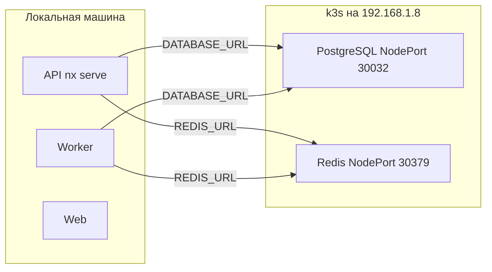

# Stage окружение — Postgres и Redis в k3s

## Текущее состояние

- [`docker-compose.yml`](docker-compose.yml) — Postgres 16, Redis 7 для локальной разработки
- [`.env.example`](.env.example) — `DATABASE_URL`, `REDIS_URL` для localhost
- API и Worker читают env из ConfigModule (NestJS) и Prisma config

## Архитектура

