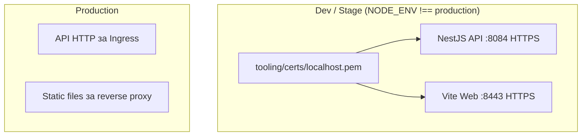

# HTTPS для local и stage окружений

## Текущее состояние

- API: NestJS + Express, `[apps/api/src/main.ts](apps/api/src/main.ts)` — `listen(3000)`, plain HTTP
- Web: Vite dev-server, `[apps/web/vite.config.ts](apps/web/vite.config.ts)` — нет `server.https`
- CORS и `VITE_API_URL` в `.env.example` / `apps/web/.env.example` — HTTP localhost
- `.gitignore` — `*.pem`, `*.key`, `*.crt` игнорируются

## Подход

- Один самоподписанный сертификат localhost для API и Web — пользователь принимает один раз
- Условие: `NODE_ENV !== 'production'` (dev и stage используют `nx serve`, где NODE_ENV = development)
- Сертификат в `tooling/certs/` — генерируется скриптом, не коммитится
- Порты: API **8084**, Web **8443**

## Реализация

### 1. Сертификаты

Добавить скрипт генерации в `package.json`:

```json
"certs": "mkdir -p tooling/certs && openssl req -x509 -newkey rsa:2048 -keyout tooling/certs/localhost-key.pem -out tooling/certs/localhost.pem -days 365 -nodes -subj \"/CN=localhost\""
```

Файлы: `tooling/certs/localhost.pem`, `tooling/certs/localhost-key.pem` (уже игнорируются `*.pem`).

Добавить `tooling/certs/.gitkeep` и краткую инструкцию в README — первый запуск: `npm run certs`.

### 2. API — NestJS

В `[apps/api/src/main.ts](apps/api/src/main.ts)`:

- Импорт `fs` и `path`
- Порт **8084** (константа или env `PORT`, по умолчанию 8084 в dev)
- При `process.env.NODE_ENV !== 'production'`:
  - Путь к сертификатам: `path.resolve(process.cwd(), 'tooling/certs/localhost.pem')` и `localhost-key.pem`
  - Проверка существования файлов (если нет — fallback на HTTP с предупреждением или exit с инструкцией)
  - `httpsOptions = { key: fs.readFileSync(...), cert: fs.readFileSync(...) }`
  - `NestFactory.create(AppModule, { httpsOptions })`
- При production — без `httpsOptions` (как сейчас)

Логировать `https://localhost:8084` при старте в dev.

### 3. Web — Vite

В `[apps/web/vite.config.ts](apps/web/vite.config.ts)`:

- **Всегда** HTTPS с сертификатом (без условия на `mode`). Vite dev server — единственный способ локально «запустить» фронт; на проде после `build` статика заливается куда угодно, там нет dev server.
- Порт **8443**: `server: { https: { key: ..., cert: ... }, port: 8443 }`
- Если сертификатов нет — fallback на HTTP на 8443, чтобы не ломать первый запуск до `npm run certs`

Использовать `path.resolve(process.cwd(), 'tooling/certs/...')` — Vite вызывается из корня воркспейса.

### 4. Обновление env-примеров

- `[.env.example](.env.example)`: `CORS_ORIGINS="https://localhost:8443"` (пример для dev)
- `[apps/web/.env.example](apps/web/.env.example)`: `VITE_API_URL=https://localhost:8084` (для локального dev с HTTPS)

### 5. Документация

- [README.md](README.md): в Quick Start добавить шаг `npm run certs` перед первым `dev:api` / `dev:web`
- Указать порты: API `https://localhost:8084`, Web `https://localhost:8443`

## Диаграмма потока



## Важные моменты

- Порты: API **8084**, Web **8443**
- API: HTTPS только при `NODE_ENV !== 'production'` (prod деплой без самоподписанного серта).
- Web: HTTPS **всегда** при `nx serve web` — Vite dev server только для local/stage; prod-сборка = статика, заливается отдельно, dev server там нет.
- `dev:api:stage` использует те же HTTPS-настройки — `NODE_ENV` остаётся `development`
- Браузер один раз попросит принять самоподписанный сертификат; для API (Swagger, fetch) — аналогично
