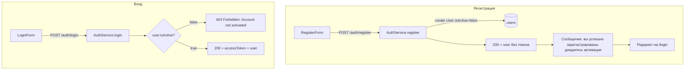

# Регистрация и флаг активности пользователя

## Текущее состояние

- **API:** `POST /auth/register` и `POST /auth/login` уже есть ([auth.controller.ts](apps/api/src/modules/auth/auth.controller.ts), [auth.service.ts](apps/api/src/modules/auth/auth.service.ts))
- **User:** модель без поля `isActive` ([schema.prisma](packages/prisma-client/prisma/schema.prisma) L87-95)
- **Web:** только LoginPage, формы регистрации нет

## План

### 1. Prisma: добавить isActive в User

В [schema.prisma](packages/prisma-client/prisma/schema.prisma) в модель `User`:

```prisma
model User {
  id              String          @id @default(cuid())
  email           String          @unique
  passwordHash    String          @map("password_hash")
  name            String?
  isActive        Boolean         @default(false) @map("is_active")  # NEW
  createdAt       DateTime        @default(now()) @map("created_at")
  ...
}
```

Миграция: `npx prisma migrate dev --name add_user_is_active` (в `packages/prisma-client` или корне, где настроен Prisma).

### 2. AuthService: login — блокировать неактивных

В [auth.service.ts](apps/api/src/modules/auth/auth.service.ts) в методе `login`, после успешной проверки пароля (`bcrypt.compare`):

```typescript
if (!user.isActive) {
  throw new ForbiddenException("Account not activated");
}
```

Использовать `ForbiddenException` (403): пользователь аутентифицирован (пароль верный), но доступ запрещён до активации.

### 3. AuthService: register — обработка дубликата email

При `prisma.user.create` с существующим email Prisma выбрасывает `PrismaClientKnownRequestError` (P2002). Обернуть в try/catch и при P2002 возвращать `ConflictException('Email already registered')` (409).

### 4. AuthService: me — проверка isActive (опционально)

Для консистентности при `/auth/me`: если `!user.isActive`, возвращать 403. Защищает случай, когда пользователя деактивировали после выдачи токена.

### 5. Web: RegisterForm и RegisterPage

- **RegisterForm** ([features/auth/ui/RegisterForm.tsx](apps/web/src/features/auth/ui/RegisterForm.tsx)) — по образцу [LoginForm.tsx](apps/web/src/features/auth/ui/LoginForm.tsx):
  - Поля: email, password, name (RegisterSchema: password min 8, name min 1)
  - POST `/auth/register`, при успехе — **показать сообщение "Вы успешно зарегистрированы. Дождитесь активации аккаунта"** и редирект на `/login`
  - При ошибке (409 и др.) — отобразить текст ошибки
- **RegisterPage** ([pages/register/RegisterPage.tsx](apps/web/src/pages/register/RegisterPage.tsx)) — аналогично LoginPage, заголовок "Регистрация", ссылка "Уже есть аккаунт? Войти".

### 6. Роутинг и навигация

- [App.tsx](apps/web/src/app/App.tsx): добавить `Route path="/register" element={<RegisterPage />}`
- [LoginPage.tsx](apps/web/src/pages/login/LoginPage.tsx): ссылка "Нет аккаунта? Зарегистрироваться" → `/register`
- RegisterPage: ссылка "Уже есть аккаунт? Войти" → `/login`

### 7. Формат ответа register

Сейчас `register` возвращает `toUserResponse(user)` — без токена. Это корректно: после регистрации пользователь не логинится (он неактивен). Фронт после успеха показывает сообщение и редирект на login.

---

## Не входит в текущий план

- **Механизм активации** — будет реализован позже (например, ссылка из письма или ручная активация админом через UPDATE `is_active = true`).

---

## Схема потока


