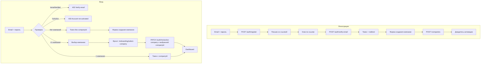

# Переработка Auth Flow: регистрация, верификация email, компании

## Соответствие документации и планам

**Не нарушает:** [ADR 0004 (CompanyMember)](docs/architecture/adr/0004-company-member-many-to-many.md), ADR 0007 (шифрование — email credentials в env, не marketplace keys), ADR 0012 (TenantGuard), [docs/architecture/overview.md](docs/architecture/overview.md), [api/openapi.md](docs/api/openapi.md).

**Расширяет/заменяет** [05-registration-isactive.plan.md](.cursor/plans/05-registration-isactive.plan.md):

- Сохраняем: `isActive`, проверку при login, механику активации админом
- Меняем: удаляем поле `name` из User полностью, добавляем email verification, обязательное создание компании, другое сообщение после регистрации («Проверьте почту» вместо «Дождитесь активации»)

---

## Текущее состояние

- **Регистрация:** [RegisterForm.tsx](apps/web/src/features/auth/ui/RegisterForm.tsx) — email, password, name. POST /auth/register создаёт User (isActive=false), после успеха — «Дождитесь активации».
- **Логин:** [LoginForm.tsx](apps/web/src/features/auth/ui/LoginForm.tsx) — email, password. POST /auth/login с опциональным `companyId`. JWT уже содержит `activeCompanyId`.
- **Компании:** [CompanyController](apps/api/src/modules/company/company.controller.ts) — POST /companies под JwtAuthGuard, [CompanyService.create](apps/api/src/modules/company/company.service.ts) создаёт Company + CompanyMember (OWNER).
- **Токен:** [jwt.strategy.ts](apps/api/src/modules/auth/jwt.strategy.ts) — `sub`, `email`, `activeCompanyId`. [TenantGuard](apps/api/src/shared/guards/tenant.guard.ts) требует `activeCompanyId` для tenant-роутов.
- Email-инфраструктуры нет.

---

## Целевые потоки




---

## 0. Config service (по образцу crm-back)

**Порядок реализации:** Раздел 0 выполняется **в первую очередь**. Все последующие разделы (Email, Auth, Redis) опираются на типизированный Config; без него MailerModule, RedisModule и миграция потребителей не согласованы.

Референс: crm-back `src/shared/config/` (Config, ConfigFactory, ConfigService, ConfigurableModuleBuilder).

### 0.1 Паттерн

- **Config** — абстрактный класс с типизированными разделами (server, db, jwt, smtp, …)
- **ConfigFactory.read()** — читает .env (dotenv), валидирует обязательные ключи, при отсутствии — `process.exit(1)` и лог с подсказкой
- **ConfigurableModuleBuilder** — NestJS `ConfigModule.registerAsync({ useFactory: () => ConfigFactory.read() })`
- **ConfigService** — инжектит Config, даёт типизированный доступ: `configService.cfg.server.port`, `configService.cfg.smtp.host`

### 0.2 Структура Config для Seller

```typescript
// config.ts
export abstract class Config {
  abstract get env(): string;
  abstract get server(): ConfigServer; // port, corsOrigins, frontendUrl
  abstract get db(): ConfigDb; // databaseUrl (Prisma)
  abstract get redis(): ConfigRedis; // url
  abstract get jwt(): ConfigJwt; // secret
  abstract get credentials(): ConfigCredentials; // encryptionKey (CREDENTIALS_ENCRYPTION_KEY)
  abstract get smtp(): ConfigSmtp; // host?, port, secure, user?, password?, from
}
```

**ConfigSmtp** — опциональные креды: если `host` пустой — `jsonTransport` (лог в консоль).

### 0.3 Файлы


| Файл                          | Назначение                                                                                                   |
| ----------------------------- | ------------------------------------------------------------------------------------------------------------ |
| `config.ts`                   | Абстрактный Config, интерфейсы ConfigServer, ConfigDb, ConfigRedis, ConfigJwt, ConfigCredentials, ConfigSmtp |
| `config.factory.ts`           | ConfigFactory.read() — dotenv, defaultConfig, валидация, создание объектов                                   |
| `config.module-definition.ts` | ConfigurableModuleBuilder, MODULE_OPTIONS_TOKEN                                                              |
| `config.module.ts`            | @Global ConfigModule, экспорт ConfigService                                                                  |
| `config.service.ts`           | ConfigService с cfg, env, server, db, redis, jwt, credentials, smtp                                          |


### 0.4 Миграция потребителей

Заменить `ConfigService` из `@nestjs/config` на кастомный ConfigService. **Удалить** `NestConfigModule` из `ConfigModule` — кастомный ConfigModule полностью заменяет его:

- PrismaService: `config.cfg.db.databaseUrl`
- AuthModule, JwtStrategy: `config.cfg.jwt.secret`
- CredentialsCryptoService: `config.cfg.credentials.encryptionKey`
- RedisModule: единый Redis connection из `config.cfg.redis.url`; экспорт для SyncQueueService (BullMQ), AuthTokenStore, rate limit. Рефакторинг SyncQueueService: получает connection через DI вместо собственного `new Redis()`.
- main.ts: после `NestFactory.create(AppModule)` — `const config = app.get(ConfigService)`; `config.cfg.server.port`, `config.cfg.server.corsOrigins` для `listen()` и `enableCors()`
- MailerModule (раздел 2): `config.cfg.smtp.`
- EmailService (раздел 2): `config.cfg.server.frontendUrl` для ссылок в письмах

### 0.5 .env.example


| Ключ                       | Обязательность | Комментарий                                    |
| -------------------------- | -------------- | ---------------------------------------------- |
| PORT                       | нет            | 8084 (default), порт API                       |
| DATABASE_URL               | да             | PostgreSQL                                     |
| REDIS_URL                  | да             | BullMQ, auth-токены (ev/pr), rate limit        |
| JWT_SECRET                 | да             | Подпись JWT                                    |
| CREDENTIALS_ENCRYPTION_KEY | да             | Шифрование credentials (32 байта hex)          |
| CORS_ORIGINS               | нет            | Через запятую                                  |
| SMTP_HOST                  | нет            | Пусто = jsonTransport                          |
| SMTP_PORT                  | нет            | 587                                            |
| SMTP_SECURE                | нет            | false                                          |
| SMTP_USER                  | нет            |                                                |
| SMTP_PASSWORD              | нет            |                                                |
| SMTP_FROM                  | нет            | noreply@...                                    |
| SMTP_DRY_RUN               | нет            | true = только логировать ссылку, не отправлять |
| FRONTEND_URL               | да             | Базовый URL фронта для ссылок в письмах        |


---

## 1. Prisma: User и Company

**Модель User** — добавить `emailVerifiedAt`, **удалить** поле `name`:

```prisma
model User {
  id              String    @id @default(cuid())
  email           String    @unique
  passwordHash    String    @map("password_hash")
  emailVerifiedAt DateTime? @map("email_verified_at")  // NEW
  isActive        Boolean   @default(false) @map("is_active")
  createdAt       DateTime  @default(now()) @map("created_at")
  companyMembers  CompanyMember[]
  @@map("users")
}
```

Токены верификации и сброса пароля — в **Redis** (не в Postgres): TTL 24h (86400 сек), автоматическое истечение, единый инстанс с BullMQ и rate limit.

## 1.1 Redis: AuthTokenStore

Сервис в `AuthModule` или `shared/` — работает через единый Redis в рамках **API процесса** (тот же connection, что SyncQueueService, rate limit). Worker — отдельный процесс, подключается к тому же Redis URL, но своим connection.

**Формат токена:** В письмо и URL попадает сырой токен (crypto.randomBytes(32), base64url). В Redis хранится **хеш** (SHA-256) — ключи `ev:{hash}`, `pr:{hash}`. При verify/reset клиент передаёт сырой токен, сервер хеширует и ищет по `ev:{hash}` / `pr:{hash}`.

**Структура ключей:**


| Ключ               | Значение  | TTL | Назначение                                      |
| ------------------ | --------- | --- | ----------------------------------------------- |
| `ev:{tokenHash}`   | userId    | 24h | verify-email — lookup по токену                 |
| `ev:user:{userId}` | tokenHash | 24h | resend — ссылка на актуальный токен             |
| `pr:{tokenHash}`   | userId    | 24h | reset-password — lookup по токену               |
| `pr:user:{userId}` | tokenHash | 24h | forgot-password — инвалидация при новом запросе |


**API AuthTokenStore:**

- `setEmailVerificationToken(userId, tokenHash)` — SET ev:{hash}, ev:user:{userId}, EX 86400
- `getUserIdByEmailVerificationToken(tokenHash)` — GET ev:{hash}, при успехе DEL ev:{hash}, DEL ev:user:{userId}
- `invalidateEmailVerificationForUser(userId)` — GET ev:user:{userId}, DEL ev:{oldHash}, DEL ev:user:{userId}; вызывать перед setEmailVerificationToken при resend
- `setPasswordResetToken(userId, tokenHash)` — SET pr:{hash}, pr:user:{userId}, EX 86400 (аналогично ev)
- `getUserIdByPasswordResetToken(tokenHash)` — GET pr:{hash}, при успехе DEL pr:{hash}, DEL pr:user:{userId}
- `invalidatePasswordResetForUser(userId)` — GET pr:user:{userId}, DEL pr:{oldHash}, DEL pr:user:{userId}; вызывать перед setPasswordResetToken при forgot-password

**Shared Redis:** SyncQueueService, AuthTokenStore, rate limit используют общий connection в API. `RedisModule` (forRoot) → экспорт connection → SyncQueueService, AuthTokenStore и ThrottleResendGuard/ThrottleForgotGuard инжектят его. **Worker** — отдельный процесс, подключается к тому же Redis URL своим connection (с `maxRetriesPerRequest: null` для BullMQ).

**Resend-инвалидация:** При resend вызывать `getOldTokenHash(userId)` (GET ev:user:{userId}), затем `DEL ev:{oldHash}` (если есть), затем `setEmailVerificationToken` с новым hash. Иначе старый токен остаётся валидным до TTL.

### 1.2 Компания

Добавить `@unique` на `name`:

```prisma
model Company {
  name  String  @unique  // глобально уникальное имя
  ...
}
```

---

## 2. Email: @nestjs-modules/mailer + шаблоны

### 2.1 Зависимости

```bash
# apps/api
npm install @nestjs-modules/mailer nodemailer pug
```

`pug` — для шаблонов (.pug).

### 2.2 Конфигурация аккаунта (env)

Переменные в [.env.example](.env.example):


| Переменная      | Описание                                                                    | Примеры                                         |
| --------------- | --------------------------------------------------------------------------- | ----------------------------------------------- |
| `SMTP_HOST`     | Хост SMTP                                                                   | `localhost`, `smtp.gmail.com`, `smtp.yandex.ru` |
| `SMTP_PORT`     | Порт                                                                        | `25`, `587`, `465`                              |
| `SMTP_SECURE`   | SSL (для 465)                                                               | `true` / `false`                                |
| `SMTP_USER`     | Логин (опц. для localhost)                                                  | `user@gmail.com`                                |
| `SMTP_PASSWORD` | Пароль / App Password                                                       | —                                               |
| `SMTP_FROM`     | Адрес отправителя                                                           | `noreply@seller.local`                          |
| `FRONTEND_URL`  | URL фронта для ссылок (логически — `server.frontendUrl` при наличии Config) | `https://app.example.com`                       |


**Gmail:** App Password, `smtp.gmail.com:587`, `SMTP_SECURE=false`.  
**Yandex:** `smtp.yandex.ru:465`, `SMTP_SECURE=true`.  
**Локальный (mailhog):** `localhost:1025`, без USER/PASSWORD.

### 2.3 MailerModule

Импорт в `AppModule` или отдельный `EmailModule`. ConfigService — кастомный из раздела 0. **Конфиг MailerModule** — в `email.module.ts` (или модуле рядом с `templates/`), чтобы `__dirname` при сборке указывал на `dist/.../email/` и `join(__dirname, 'templates')` находил шаблоны:

```typescript
import { join } from 'path';
import { PugAdapter } from '@nestjs-modules/mailer/dist/adapters/pug.adapter';

MailerModule.forRootAsync({
  imports: [ConfigModule],
  inject: [ConfigService],
  useFactory: (config: ConfigService) => {
    const smtp = config.cfg.smtp;
    if (!smtp.host) return { transport: { jsonTransport: true } }; // dev fallback — логирует в консоль
    return {
      transport: {
        host: smtp.host,
        port: smtp.port,
        secure: smtp.secure,
        auth: smtp.user ? { user: smtp.user, pass: smtp.password } : undefined,
        ignoreTLS: smtp.host === 'localhost',
      },
      defaults: { from: smtp.from },
      template: {
        dir: join(__dirname, 'templates'),
        adapter: new PugAdapter(),
        options: { strict: true },
      },
    };
  },
}),
```

**Структура папок:**

```
apps/api/src/modules/email/
  email.module.ts
  email.service.ts
  templates/
    verify-email.pug
    reset-password.pug
```

**Nx assets:** В `apps/api/project.json` в `build.options` добавить `assets` (executor `@nx/js:tsc` поддерживает). Пути относительно корня проекта (apps/api): `{ "input": "src/modules/email", "glob": "templates/**/*.pug", "output": "src/modules/email" }` — при сборке .pug попадут в `dist/apps/api/src/modules/email/templates/`.

### 2.4 Шаблоны писем

**verify-email.pug** (контекст: `{ verifyUrl, email? }`):

```pug
p Здравствуйте.
p Для подтверждения email перейдите по ссылке:
p
  a(href=verifyUrl)= verifyUrl
p Ссылка действительна 24 часа.
p Если вы не регистрировались — проигнорируйте письмо.
```

**reset-password.pug** (контекст: `{ resetUrl, email? }`):

```pug
p Здравствуйте.
p Для сброса пароля перейдите по ссылке:
p
  a(href=resetUrl)= resetUrl
p Ссылка действительна 24 часа.
p Если вы не запрашивали сброс — проигнорируйте письмо.
```

### 2.5 EmailService

Сервис в `EmailModule`:

```typescript
@Injectable()
export class EmailService {
  constructor(
    private readonly mailer: MailerService,
    private readonly config: ConfigService
  ) {}

  async sendVerificationEmail(to: string, token: string): Promise<void> {
    const baseUrl = this.config.cfg.server.frontendUrl;
    const verifyUrl = `${baseUrl}/verify-email?token=${token}`;
    await this.mailer.sendMail({
      to,
      subject: 'Подтверждение email — Seller',
      template: 'verify-email',
      context: { verifyUrl, email: to },
    });
  }

  async sendPasswordResetEmail(to: string, token: string): Promise<void> {
    const baseUrl = this.config.cfg.server.frontendUrl;
    const resetUrl = `${baseUrl}/reset-password?token=${token}`;
    await this.mailer.sendMail({
      to,
      subject: 'Сброс пароля — Seller',
      template: 'reset-password',
      context: { resetUrl, email: to },
    });
  }
}
```

### 2.6 Защита

- `SMTP_HOST` пустой → `jsonTransport: true` (логирование в консоль, без реальной отправки)
- `SMTP_DRY_RUN=true` — EmailService логирует ссылку (verifyUrl/resetUrl) и **не** вызывает `mailer.sendMail()`; для тестов без реальной отправки

---

## 3. API: Auth

### 3.0 Shared-types (auth.schema.ts)

Файл: `packages/shared-types/src/schemas/auth.schema.ts`. Добавить схемы валидации:

```ts
// RegisterSchema — без name (поле удалено из User)
export const RegisterSchema = z.object({
  email: z.string().email(),
  password: z.string().min(8),
});

export const ResendVerificationSchema = z.object({ email: z.string().email() });
export const ForgotPasswordSchema = z.object({ email: z.string().email() });
export const VerifyEmailSchema = z.object({ token: z.string().min(1) });
export const ResetPasswordSchema = z
  .object({
    token: z.string().min(1),
    password: z.string().min(8),
    passwordConfirm: z.string().min(8),
  })
  .refine((d) => d.password === d.passwordConfirm, {
    message: 'Пароли не совпадают',
    path: ['passwordConfirm'],
  });
```

### 3.1 Register

- [RegisterSchema](packages/shared-types/src/schemas/auth.schema.ts) — только email, password (поле name удалено из User)
- `AuthService.register`: создаёт User (`email`, `passwordHash`), генерирует сырой токен (crypto.randomBytes), хеширует для Redis, сохраняет через `AuthTokenStore.setEmailVerificationToken`, в письмо передаёт сырой токен, вызывает `EmailService.sendVerificationEmail`, возвращает `{ message: "Check your email" }` (без токена, без user). **Frontend:** не ожидать user в ответе, показывать «Проверьте почту».

### 3.2 Verify Email

- `POST /auth/verify-email` body: `{ token: string }` — сырой токен из URL, сервер хеширует и ищет в Redis
- Поиск userId по token через `AuthTokenStore.getUserIdByEmailVerificationToken(tokenHash)` (Redis lookup; TTL проверять не нужно — истёкший ключ отсутствует)
- **Если токен не найден или истёк** → `400 Bad Request { message: "Ссылка устарела. Запросите новое письмо." }`
- Установить `user.emailVerifiedAt = now()`, токен уже удалён при GET (одноразовый)
- Выдать JWT (без проверки isActive) и `UserResponse`. **isActive не проверяем** — активация выполняется админом после создания компании.
- Response: `{ accessToken, user }`

**Frontend:** при получении ответа сохранить `accessToken` (authStore), затем выполнить redirect на `/onboarding/company`. Роут `/onboarding/company` защищён только JwtAuthGuard — TenantGuard не требуется (activeCompanyId может быть пустым).

### 3.3 Resend verification

- `POST /auth/resend-verification` body: `{ email: string }` (без авторизации)
- Логика: найти User по email
- Если пользователя нет → `200 { message: "Если email зарегистрирован, письмо отправлено." }` (не раскрывать факт регистрации)
- Если `emailVerifiedAt !== null` → `400 Bad Request { message: "Email уже подтверждён. Войдите в систему." }`
- Вызвать `AuthTokenStore.invalidateEmailVerificationForUser(userId)`, затем `setEmailVerificationToken` с новым hash. Отправить письмо.
- **Rate limit (обязательно):** не чаще 1 раза в 2–3 минуты на email. Redis key `rate:resend:{email}` с TTL 120–180 сек. Реализация: два класса `ThrottleResendGuard` и `ThrottleForgotGuard`, наследующих базовый `ThrottleByEmailGuard` с фиксированным `keyPrefix` — при наличии ключа возвращать `429 Too Many Requests`. **Frontend:** при 429 показывать «Подождите 2 минуты» или disable кнопку с таймером.
- Response: `200 { message: "Письмо отправлено. Проверьте почту." }`

### 3.4 Login

- **Порядок проверок:** сначала `emailVerifiedAt`, затем `isActive` — чтобы при неподтверждённом email показывать «Подтвердите email», а не «Account not activated».
- Проверка `emailVerifiedAt`: если null → `403 Forbidden { message: "Подтвердите email. Проверьте почту или запросите новое письмо." }`
- **Формат ответа login:** всегда возвращать `memberships` в ответе (массив `{ companyId, companyName, role }`), чтобы фронт мог сразу решать: редирект на `/onboarding/company`, `/onboarding/select-company` или Dashboard. При 0 компаний — `memberships: []`; при 1+ — из `companyMembers`.
- Если `isActive` и `companyMembers.length === 0` → возвращать `{ accessToken, user, memberships: [] }` с `activeCompanyId: undefined`
- Если `companyMembers.length >= 1` — как сейчас (companyId в query, или первая по умолчанию). `requiresCompany` при этом **не** выставляется. Frontend покажет picker и вызовет `PATCH /auth/me/active-company` при необходимости.

### 3.5 Специальный ответ для «нужна компания»

Флаг в ответ login и `/auth/me`: `{ requiresCompany: true }` **только** когда `isActive && memberships.length === 0`. **Frontend использует флаг, не пересчитывает** — контракт явный, логика на бэке.

### 3.6 Повторная регистрация

При `POST /auth/register` с существующим email → `409 Conflict { message: "Email уже зарегистрирован" }`. Без разницы, подтверждён ли email. **Осознанное решение:** для register раскрытие факта регистрации допустимо (в отличие от resend/forgot — там анонимный ответ).

### 3.7 Forgot password (запрос сброса)

- `POST /auth/forgot-password` body: `{ email: string }` (без авторизации)
- Найти User по email
- Если пользователя нет → `200 { message: "Если email зарегистрирован, письмо отправлено." }` (не раскрывать)
- Вызвать `AuthTokenStore.invalidatePasswordResetForUser(userId)`, затем `setPasswordResetToken` с новым hash. Отправить письмо.
- **Rate limit (обязательно):** Redis key `rate:forgot:{email}` с TTL 120–180 сек. `ThrottleForgotGuard` (наследник ThrottleByEmailGuard).
- Response: `200 { message: "Если email зарегистрирован, письмо отправлено." }`

### 3.8 Reset password (установка нового пароля)

- `POST /auth/reset-password` body: `{ token: string, password: string, passwordConfirm: string }` — сырой токен из URL, сервер хеширует
- Валидация: password min 8 символов, `password === passwordConfirm` (ResetPasswordSchema)
- Найти userId по token через `AuthTokenStore.getUserIdByPasswordResetToken(tokenHash)` (Redis)
- Если токен не найден или истёк → `400 Bad Request { message: "Ссылка устарела. Запросите сброс пароля снова." }`
- Обновить `user.passwordHash` (bcrypt); токен уже удалён при GET (одноразовый)
- Response: `200 { message: "Пароль изменён. Войдите в систему." }`

### 3.9 GET /auth/me

- Endpoint `/auth/me` защищён только JwtAuthGuard, **TenantGuard не используется** — токен может быть без activeCompanyId.
- Возвращать `requiresCompany: true` при `isActive && memberships.length === 0`.
- Маршруты `/onboarding/company`, `/onboarding/select-company`, `/auth/me`, `/auth/me/active-company` — **без TenantGuard**, т.к. activeCompanyId может быть пустым.

---

## 4. Frontend: структура страниц и UI

### 4.1 Маршруты


| Маршрут                      | Описание                                                                                                                                 |
| ---------------------------- | ---------------------------------------------------------------------------------------------------------------------------------------- |
| `/login`                     | Email + пароль, ссылка «Забыли пароль?» → `/forgot-password`. При успехе — редирект по состоянию                                         |
| `/forgot-password`           | Форма: email + «Отправить» → POST /auth/forgot-password. После успеха — «Проверьте почту» + «Отправить снова» (rate limit)               |
| `/reset-password`            | Страница с `?token=`. Фронт читает token из URL, передаёт в body POST. Форма: новый пароль + подтверждение. Submit → POST /auth/reset-password. Успех → «Пароль изменён», redirect /login |
| `/register`                  | Email + пароль (без имени). После успеха — «Проверьте почту» + «Не пришло?» форма. Email предзаполнен из только что введённых данных; «Отправить снова» → POST resend-verification |
| `/verify-email`              | Страница с `?token=`. При загрузке: прочитать token из URL → POST /auth/verify-email body `{ token }`. См. 4.2.                            |
| `/onboarding/company`        | Форма создания компании (1 поле: название). Protected (JWT). После создания — «Дождитесь активации»                                      |
| `/onboarding/select-company` | Выбор компании из списка (при логине, если >1). После выбора — setActiveCompany, redirect `/`                                            |


### 4.2 Страница verify-email — состояния UI


| Состояние                            | Что видит пользователь                                                                                                            |
| ------------------------------------ | --------------------------------------------------------------------------------------------------------------------------------- |
| **Загрузка**                         | Спиннер / «Проверяем ссылку...»                                                                                                   |
| **Успех**                            | «Email подтверждён» (1–2 сек), затем redirect на `/onboarding/company`                                                            |
| **Ошибка (истёкший/неверный токен)** | «Ссылка устарела. Запросите новое письмо.» + форма: поле email + кнопка «Отправить письмо снова» → POST /auth/resend-verification |
| **Ошибка (нет token в URL)**         | «Ссылка недействительна.» + форма resend (как при истёкшем токене)                                                                 |
| **Ошибка (сетевая и др.)**           | Сообщение об ошибке + кнопка «Повторить»                                                                                          |

**Источник token:** фронт читает `?token=` из URL (`useSearchParams` / `window.location.search`) и передаёт в теле POST.

**Страница login:** при 403 «Подтвердите email» — показывать сообщение и ссылку/форму «Запросить письмо снова» (POST resend-verification с email из поля логина).

### 4.3 Уникальность имени компании

- **БД:** см. 1.2 — `@unique` на `Company.name`
- **API:** в `CompanyService.create` — при `PrismaClientKnownRequestError` P2002 (дубликат name) → `409 Conflict { message: "Компания с таким названием уже существует" }`
- **Frontend:** при 409 показывать сообщение «Такое название уже занято. Выберите другое.» под полем ввода

### 4.4 Страница reset-password — состояния UI


| Состояние          | Что видит пользователь                                                        |
| ------------------ | ----------------------------------------------------------------------------- |
| **Нет token в URL** | «Ссылка недействительна.» + ссылка на /forgot-password                         |
| **Форма**          | Поле «Новый пароль», «Подтвердите пароль», кнопка «Сохранить». Token из `?token=` подставляется в body при POST |
| **Загрузка**       | Спиннер при отправке POST /auth/reset-password                                |
| **Успех**          | «Пароль изменён. Войдите в систему.» + redirect на /login                     |
| **Ошибка (токен)** | «Ссылка устарела. Запросите сброс пароля снова.» + ссылка на /forgot-password |
| **Ошибка (сеть)**  | Сообщение об ошибке + кнопка «Повторить»                                      |


Ссылка в письме ведёт на фронт; базовый URL — из `config.cfg.server.frontendUrl`.

---

## 5–10. Остальные разделы

**Логика редиректов:** [App.tsx](apps/web/src/app/App.tsx) — маршруты `/verify-email`, `/forgot-password`, `/reset-password`, `/onboarding/company`, `/onboarding/select-company`. Protected routes: `/onboarding/` — только JwtAuthGuard (без TenantGuard, т.к. activeCompanyId может быть пустым).

**Hydrate:** authStore — при загрузке вызывать `/auth/me` если есть токен. Endpoint возвращает `requiresCompany`, `memberships`. При `requiresCompany === true` — редирект на `/onboarding/company`; при `memberships.length > 1` и нет activeCompanyId — редирект на `/onboarding/select-company`; при `memberships.length === 1` и нет activeCompanyId (устаревший токен) — установить activeCompanyId из первой компании и остаться на текущей странице или редирект на `/`.

**CreateCompanyForm:** при 409 — показать сообщение «Такое название уже занято» под полем. После успеха — «Дождитесь активации» (без вызова setActiveCompany до активации).

**SelectCompanyPage:** после выбора компании — `PATCH /auth/me/active-company` → сохранить новый токен → redirect `/`.

**Verify-email:** фронт при успехе POST verify-email сохраняет `accessToken` (authStore) до редиректа на `/onboarding/company`. Страница `/onboarding/company` — без TenantGuard.

---

## Ключевые файлы


| Компонент    | Файлы                                                                                                                                                                                                 |
| ------------ | ----------------------------------------------------------------------------------------------------------------------------------------------------------------------------------------------------- |
| Config       | config.ts, config.factory.ts, config.service.ts, config.module.ts, config.module-definition.ts                                                                                                        |
| Prisma       | schema.prisma (emailVerifiedAt, удаление name из User, Company.name unique), миграция                                                                                                                 |
| Shared-types | auth.schema.ts (RegisterSchema без name, добавить ResendVerificationSchema и др.)                                                                                                                     |
| API Auth     | auth.service.ts (UserResponse без name), auth.controller.ts, AuthTokenStore (Redis: ev/pr-токены), ThrottleResendGuard, ThrottleForgotGuard (наследники ThrottleByEmailGuard), RedisModule (shared connection) |
| API Company  | company.service.ts (P2002 → 409 для дубликата name)                                                                                                                                                   |
| API Email    | EmailModule с MailerModule, EmailService, `templates/verify-email.pug`                                                                                                                                |
| Env          | .env.example (все ключи из 0.5)                                                                                                                                                                        |
| Web          | RegisterForm, LoginForm, ForgotPasswordPage, ResetPasswordPage, VerifyEmailPage, CreateCompanyPage, SelectCompanyPage, App.tsx, authStore                                                             |


---

## Предложения

1. **@nestjs-modules/mailer** — MailerModule.forRootAsync, transport из env, Pug для шаблонов (.pug).
2. **Verification/reset tokens** — Redis (AuthTokenStore), ключи `ev:`*, `pr:`*, TTL 24h. Общий connection с BullMQ и rate limit.
3. **Страница verify-email** — `?token=` в URL; при загрузке POST /auth/verify-email с token в body.
4. **Имя** — поле `name` в User удалить полностью (Prisma, UserResponse, authStore, RegisterForm).
5. **Resend** — POST /auth/resend-verification для случая «потерял письмо»; форма на /register (успех), /verify-email (ошибка), /login (403).
6. **Company.name** — глобально уникально (@unique), 409 при дубликате, сообщение на фронте.
7. **Забыли пароль?** — ссылка на /login → /forgot-password; POST forgot-password, письмо со ссылкой; /reset-password?token=, POST reset-password; шаблон reset-password.pug.

