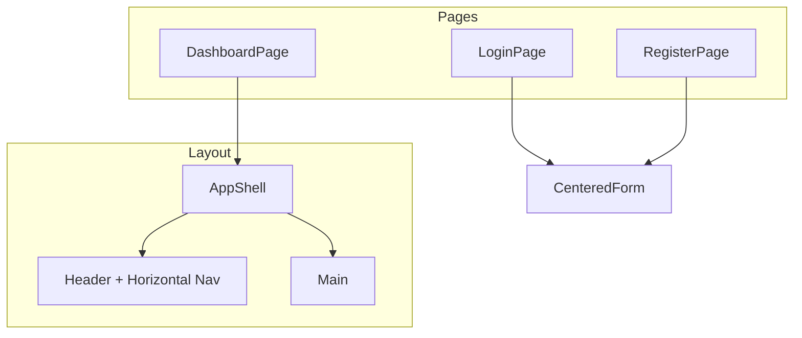

# Редизайн фронта в стиле Ozon Seller

## Референс: только стили и визуал

Скриншоты Ozon — ориентир по **внешнему виду**, не по структуре. Свои страницы, навигация, таблицы, breadcrumbs и т.п. остаются как есть, меняем лишь визуальное оформление.

**Берём из референса:**

- **Цвета**: primary #005BFF, белый фон, нейтральные серые для текста
- **Кнопки**: primary — синяя заливка; secondary — белая с синей рамкой
- **Layout header**: горизонтальное меню сверху, логотип слева, блок пользователя справа
- **Карточки**: белый фон, `rounded-lg`, лёгкая тень/бордер
- **Типографика**: sans-serif, чёткая иерархия
- **Input**: `focus:ring-primary`, border gray

## Текущее состояние

- [apps/web/src](apps/web/src): Login, Register, Dashboard; Button, Input, ProductCard
- Tailwind v4 в [apps/web/src/app/styles.css](apps/web/src/app/styles.css)
- Сейчас: bg-gray-50, blue-600, без навигации

---

## План изменений

### 1. Тема и токены (styles.css)

```css
@import 'tailwindcss';

@theme {
  --color-primary: #005bff;
  --color-primary-hover: #0047cc;
  --color-primary-light: #e6efff;
  --font-sans: 'Inter', system-ui, sans-serif;
}
```

Подключить Inter (Google Fonts) в [index.html](apps/web/index.html).

### 2. Layout: Header + Main

**AppShell** — обёртка для защищённых страниц в стиле Ozon:

- **Header**: логотип слева, горизонтальное меню (наши пункты навигации), блок пользователя справа (email, выход и т.д. — как уже есть в проекте). Активный пункт: `text-primary` + `border-b-2 border-primary`. Фон white, border-bottom.
- **Main**: padding, фон `bg-gray-50` или `bg-white`.

### 3. UI-компоненты (стили по референсу)

- **Button**: primary — `bg-primary text-white`; secondary — `bg-white border border-primary text-gray-700`; ghost — `bg-gray-100 text-gray-800`
- **Card**: `bg-white rounded-lg shadow-sm border border-gray-200` — для блоков контента
- **Input**: `focus:ring-primary`, border gray. Иконки/плейсхолдеры — по нашим требованиям.

### 4. Страницы авторизации (Login / Register)

- Центрированная карточка, `rounded-xl shadow`, белый фон
- Заголовок «Seller», подзаголовок «Вход» / «Регистрация»
- Ссылки в primary

### 5. Остальные страницы (Dashboard и др.)

Применить визуальный стиль (карточки, кнопки, цвета) к существующим страницам. Структура и контент — наши, стили — по референсу Ozon.

---

## Затрагиваемые файлы

| Файл                                             | Действие                      |
| ------------------------------------------------ | ----------------------------- |
| `apps/web/package.json`                          | lucide-react                  |
| `apps/web/index.html`                            | Inter (Google Fonts)          |
| `apps/web/src/app/styles.css`                    | @theme                        |
| `apps/web/src/app/App.tsx`                       | AppShell вокруг Dashboard     |
| `apps/web/src/shared/ui/Button.tsx`              | primary / secondary / ghost   |
| `apps/web/src/shared/ui/Input.tsx`               | focus:ring-primary            |
| `apps/web/src/shared/ui/Card.tsx`                | новый                         |
| `apps/web/src/layouts/AppShell.tsx`              | Header + Main, наша навигация |
| `apps/web/src/pages/login/LoginPage.tsx`         | стили                         |
| `apps/web/src/pages/register/RegisterPage.tsx`   | стили                         |
| `apps/web/src/pages/dashboard/DashboardPage.tsx` | виджеты, grid карточек        |

---

## Диаграмма структуры



---

## Порядок реализации

1. Тема + шрифт (styles.css, index.html)
2. lucide-react, Button (primary/secondary/ghost), Input, Card
3. AppShell с horizontal Header и навигацией
4. Редрейн Login/Register
5. Редрейн Dashboard (виджеты в grid)
