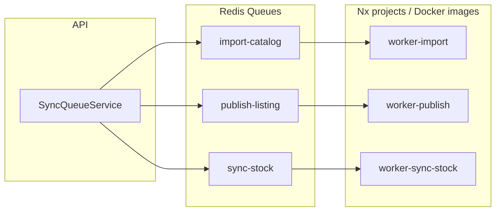

# Разделение Worker и очередей BullMQ по SRP (вариант B)

## Цель

Три отдельных Nx-проекта (`worker-import`, `worker-publish`, `worker-sync-stock`) для:

- Независимого релиза и деплоя в K8s
- Изолированной разработки (деплой отлаженных воркеров, доработка остальных)
- Трёх образов — три Deployment в K8s

## Целевая архитектура



---

## 1. packages/worker-lib — общая логика

Новый пакет с:

- `createRedisConnection()` — ioredis с `maxRetriesPerRequest: null`
- `runWorker(queueName, processor, concurrency, logLabel)` — создание Worker, события completed/failed, cleanup, SIGINT/SIGTERM
- Экспорт процессоров: `processImportCatalog`, `processPublishListing`, `processSyncStock`

Зависимости: bullmq, ioredis, @seller/domain, @seller/shared, @seller/prisma-client

---

## 2. apps/worker-import

- `src/main.ts` — подключение Redis, `runWorker(QUEUE_NAMES.IMPORT_CATALOG, processImportCatalog, 2, 'WorkerImport')`
- project.json, tsconfig.json, package.json
- Concurrency: 2 (rate limit)

---

## 3. apps/worker-publish

- `src/main.ts` — `runWorker(QUEUE_NAMES.PUBLISH_LISTING, processPublishListing, 5, 'WorkerPublish')`
- Concurrency: 5

---

## 4. apps/worker-sync-stock

- `src/main.ts` — `runWorker(QUEUE_NAMES.SYNC_STOCK, processSyncStock, 5, 'WorkerSyncStock')`
- Concurrency: 5

---

## 5. Удалить apps/worker

Удалить папку `apps/worker` целиком.

---

## 6. Обновить корневой package.json и build

- `build`: заменить `worker` на `worker-import`, `worker-publish`, `worker-sync-stock`
- `dev:worker` → `nx run worker-import:run`
- `dev:worker:import` → `nx run worker-import:run`
- `dev:worker:publish` → `nx run worker-publish:run`
- `dev:worker:sync-stock` → `nx run worker-sync-stock:run`
- `dev:worker:stage` → worker-import со stage env
- `dev:stage:all` — заменить `worker` на `worker-import` (или все три — по необходимости)

---

## 7. Документация

- [docs/runbooks/stage-deploy.md](docs/runbooks/stage-deploy.md) — три отдельных воркера, команды для каждого
- [.cursor/rules/bullmq-workers.mdc](.cursor/rules/bullmq-workers.mdc) — SRP + три Nx-проекта, независимый деплой в K8s

---

## Итоговая структура

```
packages/
  worker-lib/           # createRedisConnection, runWorker, processors
apps/
  worker-import/        # main.ts → runWorker(IMPORT_CATALOG, ...)
  worker-publish/       # main.ts → runWorker(PUBLISH_LISTING, ...)
  worker-sync-stock/    # main.ts → runWorker(SYNC_STOCK, ...)
```

Domain и API уже обновлены (3 очереди, 3 Queue в SyncQueueService). Изменений не требуют.
