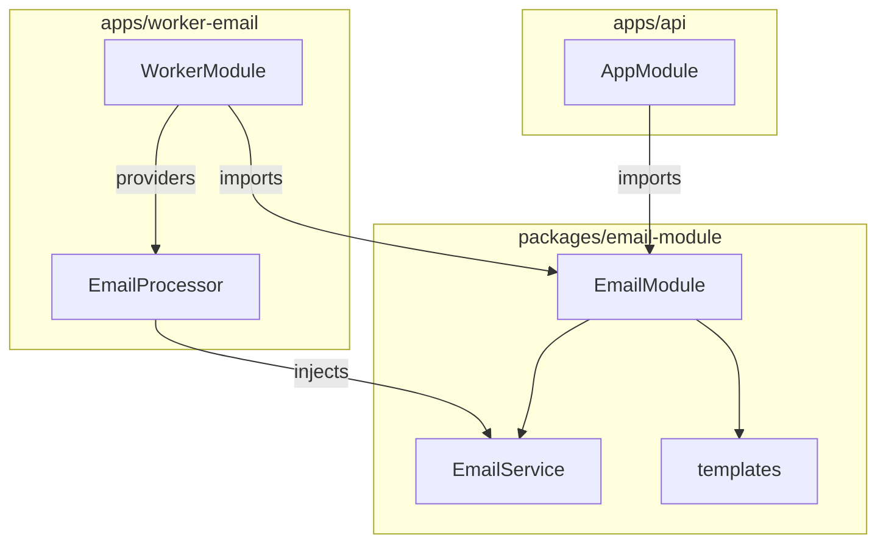

# Email Worker через BullMQ

## Текущее состояние

- Отправка почты синхронная в `AuthService` → `EmailService.sendVerificationEmail` / `sendPasswordResetEmail`
- `EmailService` использует NestJS MailerModule + Pug, ConfigService (SMTP, FRONTEND_URL)
- Воркеры: `worker-import`, `worker-publish`, `worker-sync-stock` — каждый обрабатывает свою очередь (plain Node + worker-lib)

## Целевая архитектура

- API при register / resend / forgot-password добавляет job в очередь `email`
- worker-email обрабатывает jobs по `job.name`: `verify-email`, `reset-password`

---

## Варианты реализации

### Вариант A: packages/email-lib (plain Node)

Вынести логику отправки в `packages/email-lib` — общий код без NestJS, env-based config. worker-email — plain Node, как остальные воркеры.

**Плюсы:** SRP, worker-lib без лишних зависимостей; единообразие с import/publish/sync-stock.
**Минусы:** API и worker используют разный код (API — Nest EmailService, worker — email-lib); дублирование шаблонов или отдельный пакет только для worker.

---

### Вариант B: Процессор внутри worker-lib

Добавить `processEmail` в `packages/worker-lib`, шаблоны — в worker-lib.

**Минусы:** worker-lib получает nodemailer, pug; все sync-воркеры косвенно тянут их.

---

### Вариант C: Всё в apps/worker-email

Копировать шаблоны и логику в worker-email, без shared пакета.

**Минусы:** дублирование с API; при добавлении нового типа письма — правки в двух местах.

---

### Вариант D: packages/email-module (Nest) + worker на Nest standalone

Общий Nest-модуль `packages/email-module`. API и worker используют один модуль, шаблоны, конфиг. worker-email — Nest standalone приложение с `@nestjs/bullmq`. Без самописного DI и без попадания логики в worker-lib.

**Плюсы:**

- Один источник правды: шаблоны, конфиг SMTP, логика отправки — в email-module
- Nest DI, без самописных фабрик; API и worker используют идентичный EmailService
- worker-lib остаётся без email-зависимостей
- При необходимости sync fallback в API — тот же EmailService
- Добавление нового типа письма — правки в одном месте

**Минусы:**

- worker-email — Nest-приложение (тяжелее, чем plain Node); отличается по архитектуре от import/publish/sync-stock
- Новая зависимость: `@nestjs/bullmq`
- Worker требует bootstrap Nest (NestFactory.createApplicationContext), но без HTTP — только контекст для DI

---

## Рекомендация: Вариант D

### 1. packages/email-module (новый)

Nest-модуль, self-contained:

- **EmailModule** с `forRootAsync` — конфиг из env (SMTP, FRONTEND_URL); `useFactory` читает `process.env`, без зависимости от ConfigModule API
- **EmailService** — `sendVerificationEmail(to, verifyUrl)`, `sendPasswordResetEmail(to, resetUrl)`; URL передаётся готовым (worker получает из Redis, не из job data)
- **MailerModule** — `forRootAsync` с transport (jsonTransport если SMTP_HOST пуст, иначе SMTP), `join(__dirname, 'templates')` для pug
- **templates/** — `verify-email.pug`, `reset-password.pug` (перенос из apps/api)
- Зависимости: `@nestjs-modules/mailer`, `nodemailer`, `pug`

Экспорт: `EmailModule`, `EmailService`.

### 2. packages/domain — контракт очереди

Добавить в `sync-queues.ts`:

- `QUEUE_NAMES.EMAIL = 'email'`
- `JOB_NAMES.VERIFY_EMAIL`, `JOB_NAMES.RESET_PASSWORD`
- `VerifyEmailJobData`: `{ userId, to }` — без токена
- `ResetPasswordJobData`: `{ requestId, to }` — без токена

---

## Обязательные улучшения (security, reliability)

### 1. Безопасность: не класть сырые токены в job data

BullMQ хранит `job.data` в Redis в открытом виде — токены не должны попадать в очередь.

**Решение:** передавать только идентификаторы; URL с токеном хранить в Redis и потреблять при обработке.

- **Verify:** `ev:pending:verify:{userId}` = `verifyUrl`, TTL 300. Job data: `{ userId, to }`. Worker: GET ключ, если null — skip (идемпотентность), иначе отправить письмо, DEL.
- **Reset:** `pr:pending:reset:{requestId}` = `resetUrl`, TTL 300. Job data: `{ requestId, to }`. Worker: GET, отправить, DEL.
- AuthTokenStore: новые методы `setPendingVerifyUrl(userId, verifyUrl)`, `setPendingResetUrl(requestId, resetUrl)`. Worker использует те же префиксы ключей (константы в domain или email-module).
- API строит URL после commit (см. п. 7), сохраняет в Redis, затем добавляет job.

### 2. Дедупликация jobs

Детерминированный `jobId`, чтобы не дублировать письма при повторных запросах:

- Verify: `jobId: verify:${userId}` — один job на пользователя.
- Reset: `jobId: reset:${requestId}` — `requestId` (uuid) генерируется для каждого forgot-password.

Опции для `queue.add()`: `removeOnComplete: 100`, `removeOnFail: 500`.

### 3. Ретраи, backoff, идемпотентность

- `attempts: 5`
- `backoff: { type: 'exponential', delay: 30_000 }`
- `timeout: 45_000`
- Разделение permanent vs transient: 5xx/timeout — ретраим; 550/invalid recipient — не ретраим (throw с `UnrecoverableError` или флагом).
- Идемпотентность: worker делает GET по `requestId`/`userId`; если ключа нет — считаем письмо отправленным или expired, завершаем без повторной отправки.

### 4. Rate limiting / concurrency

- `EMAIL_CONCURRENCY` (по умолчанию 3–5) — опция Worker.
- Опционально: `limiter` на Queue (max N jobs в секунду), если провайдер ограничивает.
- Env: `EMAIL_CONCURRENCY`, при необходимости `EMAIL_RATE_PER_SEC`.

### 5. Observability

- Логи: `jobId`, `name`, `attempt`, `duration`, `errorCode`.
- `QueueEvents` / `@OnWorkerEvent`: completed, failed — считать и при необходимости экспортировать метрики.
- Алерты при росте `failed` / `waiting` (например, через Prometheus или внешний мониторинг).

### 6. FRONTEND_URL

Не передавать в job data. Worker читает `FRONTEND_URL` из env (единый источник). Исключение — мультитенантность с разными origin.

### 7. Job после commit (outbox)

Сейчас в auth-флоу нет явных транзакций, но порядок операций критичен.

- Регистрация: `user.create` → `setEmailVerificationToken` → сохранить URL в Redis → `queue.add`. Если `user.create` падает, до `queue.add` не доходим.
- Важно: сохранять URL в Redis и добавлять job **после** успешного завершения всех операций с БД/Redis; не добавлять job внутри транзакции до её commit.
- При появлении транзакций: добавлять job только после commit; при необходимости — outbox (таблица событий + воркер).

---

## Реализация (с учётом улучшений выше)

### 3. apps/api — переход на email-module

- Удалить `apps/api/src/modules/email/` (перенос в packages/email-module)
- Импорт `EmailModule` из `@seller/email-module` с `forRootAsync` (можно передать config из ConfigService или оставить env)
- Добавить `EmailQueueService` (Queue на REDIS_TOKEN) — `addVerifyEmail(userId, to)`, `addResetPassword(requestId, to)`
- AuthService: (1) выполнить всё с БД/Redis, (2) сохранить `verifyUrl`/`resetUrl` в Redis через AuthTokenStore (новые методы `setPendingVerifyUrl`, `setPendingResetUrl`, TTL 300), (3) `emailQueue.addVerifyEmail` / `addResetPassword` с `jobId`, defaultJobOptions
- Default job options при add: `attempts: 5`, `backoff: { type: 'exponential', delay: 30_000 }`, `removeOnComplete: 100`, `removeOnFail: 500`

### 4. apps/worker-email (Nest standalone)

- Nest-приложение: `NestFactory.createApplicationContext(WorkerEmailModule)` — без `listen()`
- **WorkerEmailModule**:
  - `BullModule.forRoot({ connection: redis })` — redis URL из env
  - `BullModule.registerQueue({ name: QUEUE_NAMES.EMAIL })`, defaultJobOptions (attempts, backoff, timeout) на уровне Worker
  - Redis-провайдер для GET/DEL pending keys (тот же REDIS_URL) — worker подключается к тому же Redis, что и API
  - `EmailModule.forRootAsync` (тот же конфиг из env)
  - providers: `EmailProcessor`
- **EmailProcessor** extends `WorkerHost`, декоратор `@Processor(QUEUE_NAMES.EMAIL)`:
  - `constructor(private readonly emailService: EmailService, private readonly redis: RedisClient)` — worker нужен доступ к Redis для GET/DEL pending URLs
  - `process(job)`: по `job.name` — GET соответствующего ключа (ev:pending:verify:{userId} или pr:pending:reset:{requestId}); если null — завершить без ошибки (идемпотентность); иначе `emailService.sendVerificationEmail(to, verifyUrl)` / `sendPasswordResetEmail(to, resetUrl)`, DEL ключа
- Точка входа: `main.ts` — bootstrap, без serve
- Зависимости: `@nestjs/bullmq`, `@seller/email-module`, `@seller/domain`

### 5. deploy

- Worker подключается к тому же Redis (REDIS_URL) — для BullMQ и для GET/DEL pending URLs.
- Dockerfile.worker: `WORKER=email`
- workers.yaml: Deployment `seller-worker-email`
- Secret/ConfigMap: SMTP, FRONTEND_URL (worker не требует DATABASE_URL, JWT, CREDENTIALS)
- package.json: `docker:worker:email`, `dev:worker:email`

---

## Сравнение worker-email и других воркеров

| Аспект         | worker-import/publish/sync-stock | worker-email (D)             |
| -------------- | -------------------------------- | ---------------------------- |
| Runtime        | Plain Node, runWorker            | Nest standalone              |
| DI             | Нет                              | Nest DI                      |
| Зависимости    | worker-lib, bullmq               | @nestjs/bullmq, email-module |
| Обработка jobs | process(job) в worker-lib        | @Processor + WorkerHost      |

Архитектурная несогласованность приемлема: email — домен с готовым Nest-модулем (MailerModule), логично использовать его и в API, и в worker без дублирования.
