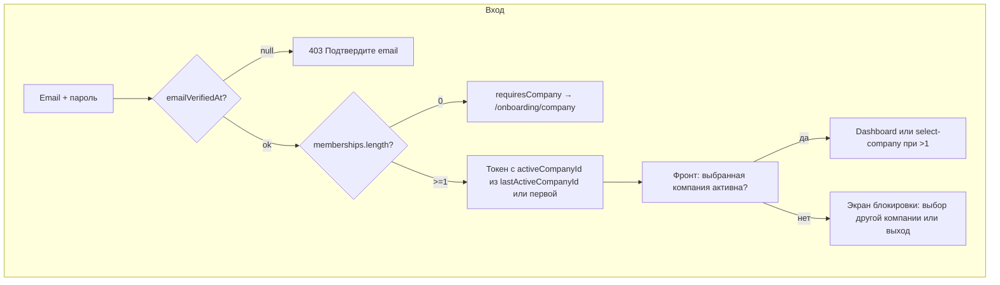

# Активация компании вместо пользователя

Новый план. Не заменяет [05-registration-isactive.plan.md](.cursor/plans/05-registration-isactive.plan.md) и [06-auth-flow-overhaul.plan.md](.cursor/plans/06-auth-flow-overhaul.plan.md) — расширяет/меняет логику активации.

## Целевая модель

- **Пользователь:** достаточно `emailVerifiedAt`. Проверка `User.isActive` убрана.
- **Работа = user + company:** без выбранной активной компании функции системы недоступны.
- **Компания:** требует `Company.isActive`; без активации работать под ней нельзя.
- **Несколько компаний:** у пользователя может быть несколько (свои + приглашённые). Выбор под любой компанией — активной или нет.
- **Запоминание:** последняя выбранная компания хранится в БД; при входе восстанавливается.
- **Выбранная неактивная компания:** доступны только переключение на другую компанию и выход. Все остальные действия заблокированы.

---

## Схема потока



---

## 1. Prisma

### 1.1 Company.isActive

В [packages/prisma-client/prisma/schema.prisma](packages/prisma-client/prisma/schema.prisma):

```prisma
model Company {
  id        String   @id @default(cuid())
  name      String   @unique
  isActive  Boolean  @default(false) @map("is_active")  # NEW
  createdAt DateTime @default(now()) @map("created_at")
  ...
}
```

Миграция: `add_company_is_active`. Для существующих записей — единоразово `UPDATE companies SET is_active = true` (опционально).

### 1.2 User.lastActiveCompanyId

```prisma
model User {
  ...
  lastActiveCompanyId  String?  @map("last_active_company_id")
  company              Company? @relation("LastActiveCompany", fields: [lastActiveCompanyId], references: [id])
  ...
}

model Company {
  ...
  usersWithLastActive  User[]   @relation("LastActiveCompany")
}
```

Или без FK — `String?` с проверкой на приложении (проще миграция). Рекомендуется вариант с relation.

Миграция: `add_user_last_active_company_id`.

---

## 2. API: AuthService

Файл: [apps/api/src/modules/auth/auth.service.ts](apps/api/src/modules/auth/auth.service.ts).

### 2.1 Убрать проверку User.isActive

В `login` и `me` удалить блок:

```ts
if (!user.isActive) {
  throw new ForbiddenException('Аккаунт не активирован');
}
```

### 2.2 Memberships с isActive

В `login` и `me` в memberships добавить `isActive`:

```ts
memberships: user.companyMembers.map((m) => ({
  companyId: m.companyId,
  companyName: m.company.name,
  role: m.role,
  isActive: m.company.isActive,
})),
```

Include в Prisma: `companyMembers: { include: { company: true } }` (уже есть).

### 2.3 resolveActiveCompany и activeCompanyId

- Приоритет: `user.lastActiveCompanyId` (если в memberships), иначе первая компания.
- Разрешать и активные, и неактивные компании — пользователь может выбрать любую; блокировка только на фронте и в TenantGuard.

### 2.4 Флаги в ответах login / me

- `requiresCompany: true` — когда `memberships.length === 0`.

### 2.5 setActiveCompany

В [auth.service.ts](apps/api/src/modules/auth/auth.service.ts) метод `setActiveCompany`:

1. Проверить членство в компании (без проверки `isActive`).
2. Выдать новый JWT.
3. Обновить `User.lastActiveCompanyId`:

```ts
await this.prisma.user.update({
  where: { id: userId },
  data: { lastActiveCompanyId: companyId },
});
```

---

## 3. API: TenantGuard

Файл: [apps/api/src/shared/guards/tenant.guard.ts](apps/api/src/shared/guards/tenant.guard.ts).

Дополнительная проверка: если `activeCompanyId` указан, компания должна быть активна. Варианты:

- **A:** Инжектить PrismaService и проверять `company.isActive` по `activeCompanyId`.
- **B:** Новый guard `CompanyActiveGuard` (после TenantGuard).
- **C:** Middleware/декоратор, который проверяет активность.

Рекомендация: **A** — добавить проверку в TenantGuard, если компания неактивна → 403 «Компания не активирована».

---

## 4. Frontend

### 4.1 Роутинг и hydrate

Файл: [apps/web/src/app/App.tsx](apps/web/src/app/App.tsx).

При hydrate (`/auth/me`) и после login:

| Условие                                          | Действие                                             |
| ------------------------------------------------ | ---------------------------------------------------- |
| `requiresCompany`                                | `navigate('/onboarding/company', { replace: true })` |
| `memberships.length > 1` и нет `activeCompanyId` | `navigate('/onboarding/select-company')`             |
| Иначе                                            | `navigate('/')` или остаться                         |

### 4.2 Принудительное создание компании

При `requiresCompany === true` пользователь не должен уходить с `/onboarding/company`:

- `/onboarding/company` вне AppShell (без навигации в Dashboard).

### 4.3 Экран блокировки при неактивной компании

Когда `activeCompanyId` указывает на неактивную компанию (из `memberships` по `isActive`):

- Вместо Dashboard показывать блокирующий экран.
- Текст: «Компания [название] ожидает активации. Выберите другую компанию или выйдите из системы.»
- Элементы: **переключатель компаний** (все компании), **Выйти**.
- Реализация: в AppShell или layout проверять `memberships.find(m => m.companyId === activeCompanyId)?.isActive`; при `false` рендерить блокирующий экран вместо `<Outlet />`.
- **authStore:** сохранять `memberships` при login и hydrate (`/auth/me`), чтобы проверка и переключатель работали на клиенте.

### 4.4 Переключатель компаний (Company Switcher)

- В header AppShell: выпадающий список всех компаний из `memberships`.
- При смене: `PATCH /auth/me/active-company` → обновить токен в authStore.
- Показывать при `memberships.length >= 1` (для приглашённых — см. будущий план).

### 4.5 SelectCompanyPage

Файл: [apps/web/src/pages/onboarding/SelectCompanyPage.tsx](apps/web/src/pages/onboarding/SelectCompanyPage.tsx).

- Показывать **все** компании (активные и неактивные), с пометкой статуса (например, «ожидает активации»).
- После выбора — `setActiveCompany`, redirect `/`. Если выбрана неактивная — на `/` сработает экран блокировки.

### 4.6 CreateCompanyPage

Файл: [apps/web/src/pages/onboarding/CreateCompanyPage.tsx](apps/web/src/pages/onboarding/CreateCompanyPage.tsx).

Текст после успешного создания: «Дождитесь активации компании» (вместо «активации аккаунта»).

---

## 5. API: активация компании

Механизм включения `Company.isActive` — отдельная задача. Варианты:

- Admin API: `PATCH /admin/companies/:id` с `{ isActive: true }`.
- Скрипт миграции.
- Позже — админ-панель.

В этом плане только поле в БД; включать `isActive` предполагается вручную или отдельным планом.

---

## 6. Типы и контракты

В `LoginResponse` и `MeResponse` (или shared-types):

- `memberships: { companyId, companyName, role, isActive }[]`
- `requiresCompany?: boolean`

---

## Ключевые файлы

| Область  | Файлы                                                                                                                                                                                                                                              |
| -------- | -------------------------------------------------------------------------------------------------------------------------------------------------------------------------------------------------------------------------------------------------- |
| Prisma   | [schema.prisma](packages/prisma-client/prisma/schema.prisma), миграции                                                                                                                                                                             |
| Auth     | [auth.service.ts](apps/api/src/modules/auth/auth.service.ts)                                                                                                                                                                                       |
| Guards   | [tenant.guard.ts](apps/api/src/shared/guards/tenant.guard.ts)                                                                                                                                                                                      |
| Frontend | [App.tsx](apps/web/src/app/App.tsx), [AppShell.tsx](apps/web/src/layouts/AppShell.tsx), [CreateCompanyPage.tsx](apps/web/src/pages/onboarding/CreateCompanyPage.tsx), [SelectCompanyPage.tsx](apps/web/src/pages/onboarding/SelectCompanyPage.tsx) |
