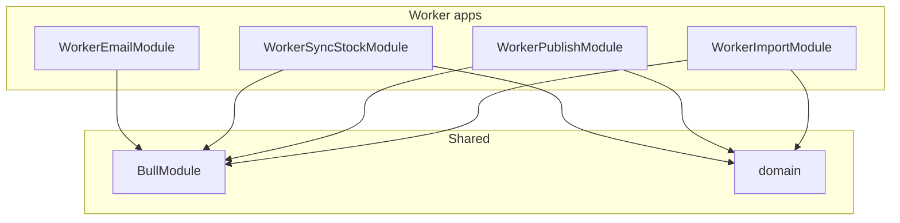

# Миграция воркеров на Nest standalone

## Текущее состояние

| Воркер            | Реализация                                    | Зависимости                          |
| ----------------- | --------------------------------------------- | ------------------------------------ |
| worker-email      | Nest standalone, WorkerHost, BullModule       | @nestjs/bullmq, @seller/email-module |
| worker-import     | plain Node, runWorker + processImportCatalog  | @seller/worker-lib                   |
| worker-publish    | plain Node, runWorker + processPublishListing | @seller/worker-lib                   |
| worker-sync-stock | plain Node, runWorker + processSyncStock      | @seller/worker-lib                   |

## Целевая архитектура

Все 4 воркера — Nest standalone:

---

## 1. worker-import

**Файлы:**

- [apps/worker-import/src/main.ts](apps/worker-import/src/main.ts) — заменить на Nest bootstrap (по образцу [apps/worker-email/src/main.ts](apps/worker-email/src/main.ts))
- [apps/worker-import/src/worker-import.module.ts](apps/worker-import/src/worker-import.module.ts) — создать
- [apps/worker-import/src/import.processor.ts](apps/worker-import/src/import.processor.ts) — создать (логику перенести из [packages/worker-lib/src/processors/import.processor.ts](packages/worker-lib/src/processors/import.processor.ts))

**Модуль:**

- BullModule.forRoot(connection), BullModule.registerQueue({ name: QUEUE_NAMES.IMPORT_CATALOG })
- ImportProcessor @Processor('import-catalog', { concurrency: 2 })
- Redis connection — как в worker-email через createRedisProvider/getRedisConnection

**main.ts:**

- reflect-metadata, dotenv, NestFactory.createApplicationContext(WorkerImportModule), app.init()

---

## 2. worker-publish

Аналогично worker-import:

- WorkerPublishModule, PublishProcessor
- concurrency: 5, queue: publish-listing

---

## 3. worker-sync-stock

Аналогично worker-import:

- WorkerSyncStockModule, SyncStockProcessor
- concurrency: 5, queue: sync-stock

---

## 4. Зависимости apps

В [apps/worker-import/package.json](apps/worker-import/package.json), [apps/worker-publish/package.json](apps/worker-publish/package.json), [apps/worker-sync-stock/package.json](apps/worker-sync-stock/package.json):

- Удалить `@seller/worker-lib`
- Добавить: `@nestjs/common`, `@nestjs/core`, `@nestjs/bullmq`, `bullmq`, `ioredis`, `reflect-metadata`, `dotenv`, `rxjs`

---

## 5. packages/worker-lib

- После миграции воркеры не зависят от worker-lib
- Оставить пакет (runWorker, createRedisConnection) для возможного переиспользования; можно удалить позже
- Процессоры в worker-lib (import, publish, sync-stock) можно удалить — логика переехала в apps

---

## 6. Deploy

**Dockerfile.worker** — уже поддерживает WORKER=import|publish|sync-stock|email. Сейчас для email используется отдельный Dockerfile.worker-email.

Варианты:

- **A:** Унифицировать — один Dockerfile.worker для всех: `npx nx run worker-${WORKER}:build` (nx соберёт зависимости автоматически)
- **B:** Оставить два Dockerfile (worker и worker-email)

Рекомендация: **A** — единый Dockerfile.worker, build через `npx nx run worker-${WORKER}:build`. Удалить Dockerfile.worker-email и скрипт docker:worker:email переключить на Dockerfile.worker.

**workers.yaml** — без изменений (отдельные образы уже заданы).

**package.json scripts:**

- docker:worker:email — использовать Dockerfile.worker с WORKER=email
- entrypoint — все воркеры запускаются как `node dist/apps/worker-${WORKER}/src/main.js` (или main.js в корне outputPath)

---

## 7. Redis provider

Скопировать [apps/worker-email/src/redis.provider.ts](apps/worker-email/src/redis.provider.ts) в каждый воркер. Альтернатива: вынести в `packages/worker-shared` — для 3 файлов копирование проще (KISS).

---

## 8. Порядок выполнения

1. worker-import (полный цикл: модуль, процессор, main, package.json, project.json implicitDependencies)
2. worker-publish
3. worker-sync-stock
4. Унификация Dockerfile, обновление package.json scripts
5. Удаление processor exports из worker-lib (опционально)
