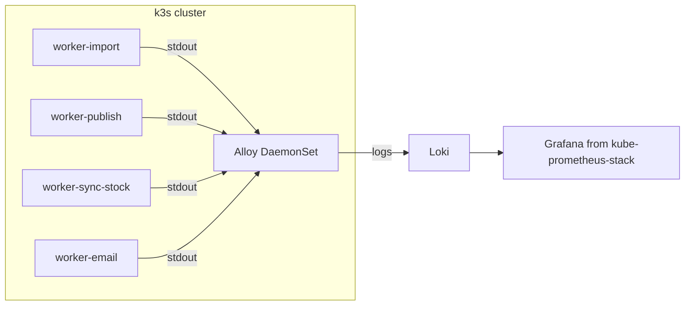

# Мониторинг stage — рекомендации (обновлено)

Окружение: **k3s на 192.168.1.8**, namespace `seller-stage`, 4 воркера (import, publish, sync-stock, email). Winston уже пишет в stdout с label'ами (`{ImportProcessor}`, `{PublishProcessor}` и т.д.) — логи готовы к сбору.

---

## 1. Быстрый старт (без новых сервисов)

### kubectl и Stern

```bash
# Логи конкретного пода
kubectl logs -f deployment/seller-worker-import -n seller-stage

# Логи всех воркеров одновременно (по label)
stern seller-worker -n seller-stage
```

**Stern** — tail логов из нескольких подов по label. Установка: `brew install stern` или скачать [релиз](https://github.com/stern/stern/releases).

### K9s (TUI)

Интерактивный терминальный UI для K8s: выбор namespace → выбор deployment → логи в реальном времени, переключение между подами, статусы.

```bash
brew install k9s
k9s -n seller-stage
```

---

## 2. Облачный стек (минимум настройки)

### Grafana Cloud (free tier)

- **Grafana Alloy** на кластер — собирает логи (Loki) и метрики (Prometheus). **Grafana Agent EOL** (1 ноября 2025) — использовать только Alloy.
- Логи из stdout автоматически попадают в Loki
- Дашборды, поиск по логам, алерты в облаке

[Grafana Alloy для K8s](https://grafana.com/docs/alloy/latest/get-started/install/alloy-on-kubernetes/)

---

## 3. kube-prometheus-stack — одна Grafana

**kube-prometheus-stack** уже включает **Grafana**. Не дублировать: при добавлении Loki — подключать его как datasource к этой же Grafana.

| Подход | Действие |
|--------|----------|
| Ставишь kube-prometheus-stack | Используй встроенную Grafana |
| Ставишь Loki отдельно | Добавляй datasource в **ту же** Grafana |

**Анти-паттерн:** несколько Grafana в одном кластере без причины.

---

## 4. Loki на одной ноде k3s

Stage на одной машине (192.168.1.8). Настройки Loki под single-node:

| Параметр | Значение | Зачем |
|----------|----------|-------|
| Режим | single-binary | Все компоненты в одном процессе |
| Retention | 7–14 дней | Ограничить рост данных |
| Storage | filesystem | Не S3 на stage |
| Ресурсы | 256–512MB | Предсказуемое потребление |

Иначе Loki начнёт неожиданно есть диск.

### Prometheus — retention и объём TSDB

По умолчанию Prometheus хранит данные долго. Для stage достаточно:

| Параметр | Значение | Зачем |
|----------|----------|-------|
| Retention | 7–15 дней | Ограничить рост |
| TSDB | Ограничить размер | Иначе через пару месяцев съест диск |

- Официальный **[loki](https://github.com/grafana/loki/tree/main/production/helm/loki)** chart
- **Alloy** — сбор логов из stdout, отправка в Loki



---

## 5. Реально полезные алерты

Не «CPU 80%», а то, что сигналит о реальных проблемах воркеров:

| Тип | PromQL идея | Зачем |
|-----|-------------|-------|
| OOMKilled | `kube_pod_container_status_last_terminated_reason{reason="OOMKilled"} > 0` | Очень частая причина падений воркеров |
| Pod restarts | `increase(kube_pod_container_status_restarts_total[5m]) > 3` | Ловим CrashLoop |
| Deployment down | `kube_deployment_status_replicas_unavailable > 0` | Воркер не запущен |
| Queue lag | `bull_queue_waiting_jobs > N` | Зависла очередь |
| Failed jobs rate | `increase(bull_queue_failed_total[5m]) > X` | Код начал падать |

OOMKilled важнее алертов по CPU.

---

## 6. BullMQ — экспорт метрик

Без экспорта метрик Prometheus не увидит queue lag и failed jobs. «Queue lag» без них — только guesswork по Redis.

Нужно:

- Добавить **`/metrics`** endpoint (или отдельный порт)
- Использовать **prom-client**
- Отдавать: `waiting`, `active`, `failed`, `completed`, duration histogram

**Кардинальность — обязательно:**

- **Не** создавать метрики динамически по `queue name` или `job name`
- **Не** использовать `userId` как label
- **Не** делать label на каждую ошибку

| Анти-паттерн | Правильно |
|--------------|-----------|
| `bull_job_failed_total{jobId="123"}` | `bull_job_failed_total{queue="import"}` |

Иначе Prometheus взорвётся по кардинальности. Labels — только фиксированные, низкокардинальные (`queue`, не `jobId`).

---

## 7. Рекомендуемый порядок внедрения

| Этап | Что ставим                  | Зачем                                             |
| ---- | --------------------------- | ------------------------------------------------- |
| 0    | **k9s** + **stern**         | Быстро смотреть статусы и логи без инфраструктуры |
| 1    | **kube-prometheus-stack**   | Алерты «упало / рестартится», Grafana для метрик  |
| 1a   | **BullMQ `/metrics`**       | Экспорт метрик воркеров (иначе алерты queue lag не работают) |
| 2    | **Loki** + **Alloy**        | История логов, datasource в ту же Grafana        |
| 3    | (опц.) OTel traces / Sentry | Быстро находить причины ошибок в коде            |

---

## 8. JSON-логи (опционально)

Для Loki удобнее **структурированный JSON** — проще фильтровать по `level`, `label`, `error.stack`.

**Важно:** не использовать `requestId`, `userId`, `jobId` как **labels** в Loki (высокая кардинальность, рост нагрузки). Оставлять их **полями в JSON**. В labels держать стабильное: `app`, `namespace`, `pod`, `container`, `level`, `worker`.

Добавить второй transport в [packages/shared/src/log/logger.winston.ts](packages/shared/src/log/logger.winston.ts) с `winston.format.json()` при `LOG_FORMAT=json`. По умолчанию — человекочитаемый вывод.

---

## 9. Документация — Runbook и развёртывание

### 9a. Развёртывание в новом окружении

Создать **[docs/runbooks/monitoring-deploy.md](docs/runbooks/monitoring-deploy.md)**:

- **Предварительные условия:** Helm, kubectl, доступ к кластеру
- **Этап 0:** k9s, stern — установка (brew / бинарники)
- **Этап 1:** kube-prometheus-stack — Helm install, values (Prometheus retention 7–15 дней, TSDB limits), namespace
- **Этап 1a:** BullMQ `/metrics` — если ещё не сделано, добавить в воркеры
- **Этап 2:** Loki (single-binary, retention 7–14 дней, filesystem, лимиты 256–512MB) + Alloy (DaemonSet), подключение Loki как datasource в Grafana из kube-prometheus-stack
- **Алерты:** добавление правил из разд. 5 (PrometheusRule), настройка Alertmanager (Telegram/Email)
- **Адаптация под окружение:** namespace (например `seller-stage` vs `monitoring`), селекторы для scrape, NodePort/Ingress для Grafana при необходимости

**Версионирование Helm — обязательно:**

| Правило | Зачем |
|---------|-------|
| `values.yaml` хранится в repo (например `deploy/monitoring/values-*.yaml`) | Воспроизводимость, code review |
| Не использовать inline `--set` | Конфиг должен быть в файле |
| Фиксировать версии чартов `--version X.Y.Z` | Иначе через полгода всё разъедется |

| Анти-паттерн | Правильно |
|--------------|-----------|
| `helm install kube-prometheus-stack ...` (без `--version`) | `helm install ... --version X.Y.Z -f deploy/monitoring/kube-prometheus-stack-values.yaml` |

### 9b. Runbook — как пользоваться

Создать **[docs/runbooks/stage-monitoring.md](docs/runbooks/stage-monitoring.md)**:

- **Как пользоваться:** k9s (навигация, логи, события), stern (tail по label), Grafana (дашборды, логи Loki, алерты)
- **Где смотреть:** URL Grafana, где лежат конфиги алертов, как добавить Loki datasource
- **Типовые сценарии:** «воркер упал» → куда идти (Events, логи, алерты), «очередь растёт» → метрики BullMQ
- **Ссылка на развёртывание:** [monitoring-deploy.md](docs/runbooks/monitoring-deploy.md) — как развернуть в новом окружении

Добавить оба файла в [docs/runbooks/](docs/runbooks/) и упомянуть в [AGENTS.md](AGENTS.md) (раздел «Документация»).

---

## 10. Правила — мониторинг и observability

Добавить **[.cursor/rules/monitoring-observability.mdc](.cursor/rules/monitoring-observability.mdc)** (на английском):

- **Следовать принятой структуре** мониторинга (kube-prometheus-stack, Loki, BullMQ метрики, алерты из разд. 5)
- **При изменениях/добавлениях в коде** учитывать observability:
  - новые воркеры/очереди → экспортировать метрики (queue, waiting, failed) с низкокардинальными labels
  - новые ошибки / критичные ветки → логировать через `createLogger`, при необходимости — алерт
  - API endpoints → access logs (уже есть), тяжёлые операции — рассмотреть метрики
- **Кардинальность:** не использовать userId, jobId, requestId в labels (Prometheus, Loki) — только в полях JSON/логах

---

## Ссылки

- [Stern](https://github.com/stern/stern)
- [K9s](https://github.com/derailed/k9s)
- [Grafana Alloy](https://grafana.com/docs/alloy/latest/)
- [kube-prometheus-stack](https://github.com/prometheus-community/helm-charts/tree/main/charts/kube-prometheus-stack)
- [Loki Helm chart](https://github.com/grafana/loki/tree/main/production/helm/loki)
- [prom-client](https://github.com/siimon/prom-client) — для BullMQ метрик
