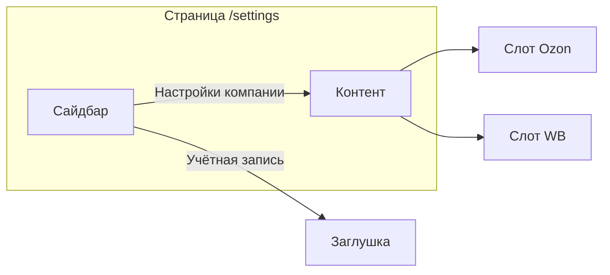

# Страница настроек компании с API-ключами Ozon и WB

## Текущее состояние

**Бэкенд:**

- `MarketAccount` — модель с `credentialsEncrypted` (AES-256-GCM)
- `MarketAccountController`: `GET/POST/PATCH/DELETE /api/companies/:companyId/accounts`
- Ozon: `clientId` + `apiKey`; WB: `apiKey`
- [apps/api/src/modules/market-account/](apps/api/src/modules/market-account/)
- **Ограничение:** у компании максимум **один** WB и **один** Ozon (см. ниже)

**Фронтенд:**

- Кнопка «Настройки» в выпадающем меню профиля (ProfileDropdown) → ведёт на `/settings`
- `/settings` → рендерит `DashboardPage` (заглушка) — заменить на страницу настроек
- `apiFetch`, `useAuthStore` (activeCompanyId), UI: Card, Button, Input
- Toast: добавить `react-toastify` по образцу crm-front

## План реализации

### 1. Layout страницы настроек (как на скриншоте Ozon)

**Структура:** два столбца — слева подменю, справа контент.

- **Левая колонка (сайдбар):** вертикальное меню с разделами:
  - «Настройки компании» — реализуем (API-ключи Ozon и WB)
  - «Учётная запись» — пункт меню есть, контент **не реализуем** (заглушка «Скоро» или пусто)
  - Позже будут другие разделы
- **Правая колонка:** контент выбранного раздела. Сейчас только «Настройки компании» с полным функционалом.
- Редактируем **текущую** компанию — `activeCompanyId` из auth store.

### 2. Ограничение: один Ozon и один WB на компанию

- **Миграция Prisma:** добавить `@@unique([companyId, marketplace])` в модель `MarketAccount`
- **Backend:** `MarketAccountService.create` — при нарушении unique выбросить `ConflictException` с понятным сообщением («Ozon уже подключён» / «Wildberries уже подключён»)
- **UI:** показывать два «слота»: Ozon и WB. Если слот занят — карточка с кнопками «Изменить», «Удалить». Если пуст — кнопка «Подключить Ozon» / «Подключить WB»

### 3. Список и форма

- `GET /api/companies/{activeCompanyId}/accounts` при загрузке
- **Слот Ozon:** занят → карточка (название, «Изменить», «Удалить»); пуст → кнопка «Подключить Ozon»
- **Слот WB:** аналогично
- **Форма добавления/редактирования:** маркетплейс задаётся слотом (не переключатель). Ozon: clientId + apiKey; WB: apiKey. Поле «Название» — опционально или фиксировано («Ozon», «Wildberries»)
- `POST` при создании, `PATCH` при обновлении credentials
- Ошибки и успех — через `toastError` / `toastSuccess` (react-toastify)

### 3.1 Toast (react-toastify)

По образцу crm-front:

- **Зависимость:** `react-toastify` (версия фиксированная, без `^`)
- **Файл:** `apps/web/src/shared/ui/toast/toast-helper.ts`:
  - `toastSuccess(message: string)` — position top-center, autoClose 2000, theme colored, Bounce
  - `toastError(message: string)` — аналогично, поддержка `\n` (whiteSpace pre-line)
- **App:** добавить `ToastContainer` и `import 'react-toastify/dist/ReactToastify.css'` в [apps/web/src/app/App.tsx](apps/web/src/app/App.tsx) или Providers
- **Экспорт:** `apps/web/src/shared/ui/index.ts` — `export * from './toast/toast-helper'`

### 4. Роутинг

Кнопка «Настройки» в ProfileDropdown уже ведёт на `/settings`. В [apps/web/src/app/App.tsx](apps/web/src/app/App.tsx):

- `Route path="settings"` — layout с сайдбаром + `<Outlet />`
- Вложенные: `settings/company` (настройки компании, API-ключи), `settings/account` (заглушка)
- `/settings` — redirect на `/settings/company`

### 5. Схема экрана

### 6. API URL

Формат: `/api/companies/${activeCompanyId}/accounts` — `activeCompanyId` из `useAuthStore().user?.activeCompanyId`. TenantGuard на бэке проверяет соответствие.

### 7. Сообщения (русский)

- «Подключение маркетплейсов», «Добавить аккаунт», «Ozon», «Wildberries»
- «Client-ID» (Ozon), «API-ключ», «Название» (например: «Ozon основной»)
- Ошибки: «Аккаунт маркетплейса не найден», «Ошибка при сохранении» и т.п.

## Затрагиваемые файлы

| Файл                                                         | Действие                                                               |
| ------------------------------------------------------------ | ---------------------------------------------------------------------- |
| `packages/prisma-client/prisma/schema.prisma`                | `@@unique([companyId, marketplace])` у MarketAccount                   |
| `packages/prisma-client/prisma/migrations/`                  | Новая миграция                                                         |
| `apps/api/.../market-account.service.ts`                     | ConflictException при дубликате marketplace                            |
| `apps/web/package.json`                                      | Добавить `react-toastify`                                              |
| `apps/web/src/shared/ui/toast/toast-helper.ts`               | Создать (toastSuccess, toastError)                                     |
| `apps/web/src/shared/ui/index.ts`                            | Экспорт toast helper                                                   |
| `apps/web/src/app/App.tsx`                                   | ToastContainer + CSS; nested routes settings/company, settings/account |
| `apps/web/src/pages/settings/SettingsLayout.tsx`             | Layout: сайдбар + Outlet                                               |
| `apps/web/src/pages/settings/CompanySettingsContent.tsx`     | Контент: слоты Ozon, WB (API-ключи)                                    |
| `apps/web/src/pages/settings/AccountSettingsPlaceholder.tsx` | Заглушка «Учётная запись» (Скоро)                                      |

## Зависимости

- `react-toastify` — версия без `^` (конвенция seller: фиксированные версии)
