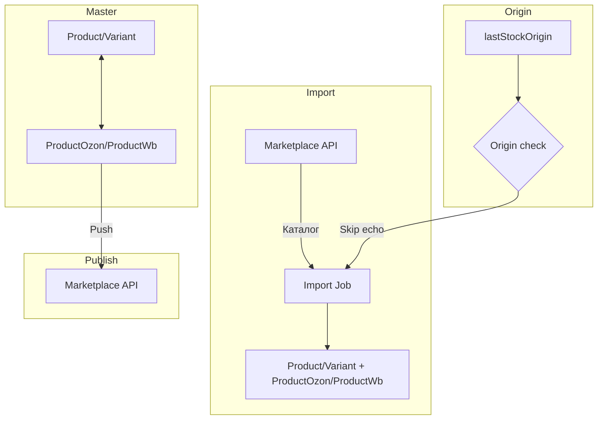

# Поток данных синхронизации

## Origin tracking

- При импорте: не перезаписывать master, если `lastStockOrigin` уже с этой площадки
- При push: hash-сравнение, skip echo (защита от ping-pong циклов)
